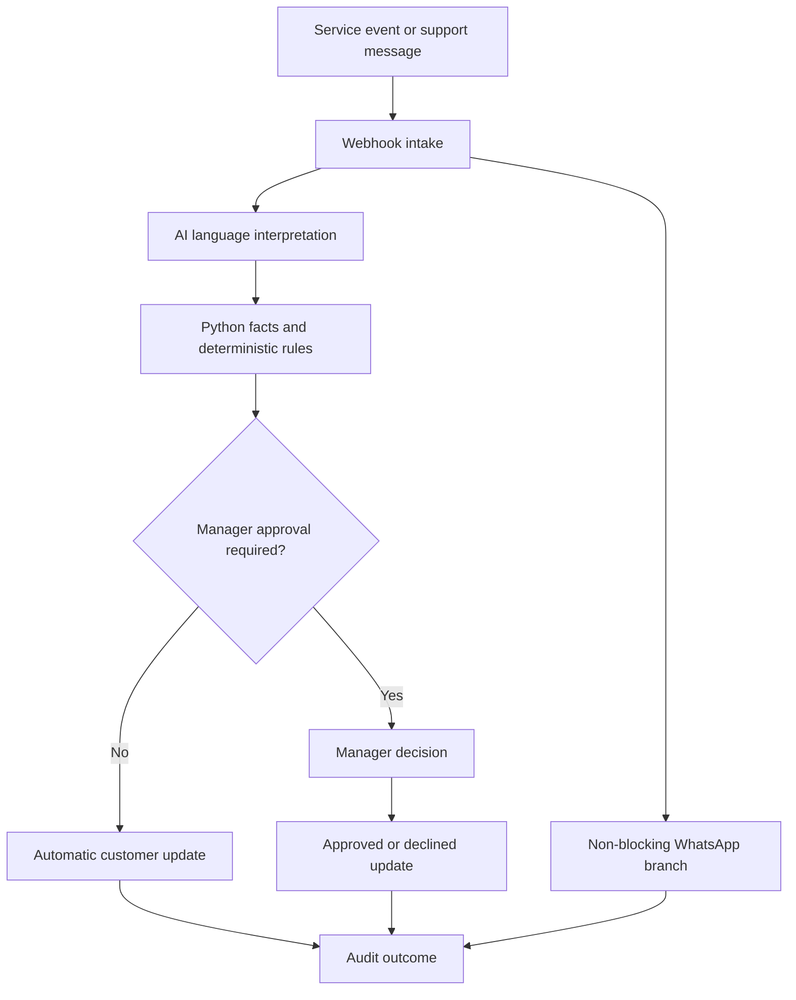

# OpsGuard AI 

OpsGuard is a governed exception-handling prototype for household-service operations. It detects a service failure, interprets customer language, applies deterministic business rules, requests human approval when required, and coordinates customer and worker communication through email and WhatsApp.

The project demonstrates a practical operating principle:

> AI interprets customer language. Rules calculate operational facts. Humans retain control of consequential decisions.

## Validated V3 result

The V3 workflow has been tested end to end with a synthetic case:

- The webhook accepted a simulated helper no-show.
- The customer received an initial email update.
- A manager received an approval request for a refund above the automatic limit.
- The manager approved the synthetic ₹500 refund.
- The customer received the approval email.
- A Twilio WhatsApp trial template was delivered successfully.
- All 10 Python regression tests passed.

No real helper assignment, payment, or refund was performed.

## Business problem

A helper no-show creates several linked operational risks: customer dissatisfaction, replacement eligibility, refund policy, manager escalation, and multi-channel communication. Handling these manually is slow and inconsistent. Allowing a language model to make every decision introduces a different risk: an unverified or unauthorized action.

OpsGuard separates interpretation from execution so each stage has an explicit owner and control.

## Architecture



The WhatsApp branch continues on error so a temporary channel failure cannot block the main email and manager-decision path.

## Decision controls

| Concern | Owner | Control |
|---|---|---|
| Customer intent and sentiment | AI interpretation | Produces structured signals only |
| Lateness, eligibility, and thresholds | Python rules | Deterministic and testable |
| Refund above policy limit | Human manager | Explicit approve or decline action |
| Customer and worker communication | n8n workflow | Credentialed nodes and auditable executions |
| Channel failure | Workflow configuration | WhatsApp branch continues on error |

## Demonstration case

The synthetic case `EZH-1042` models a confirmed cleaner who has not checked in and is 30 minutes late. The customer has a 1:00 PM deadline. An eligible replacement, Anjali, could arrive around 10:15 AM. The requested refund is ₹500, above the ₹300 automatic-policy limit, so manager approval is required.

The workflow sends an immediate customer update, asks the manager for a decision, records the outcome, and attempts the WhatsApp notification independently.

## Repository structure

```text
opsguard-ezyhelpers/
├── app.py                              # Streamlit demonstration dashboard
├── opsguard/
│   ├── workflow.py                    # Main orchestration logic
│   ├── rules.py                       # Deterministic business rules
│   ├── models.py                      # Typed data models
│   ├── demo_data.py                   # Synthetic scenarios
│   └── services.py                    # Optional AI integration boundary
├── n8n/
│   └── opsguard_multichannel_workflow_v3.json
├── tests/
│   └── test_workflow.py               # Regression tests
├── outputs/
│   └── demo_result.json               # Example structured result
├── N8N_SETUP_GUIDE.md
└── PROJECT_WALKTHROUGH.md
```

## Run locally

Requirements: Python 3.10 or later.

```bash
cd opsguard-ezyhelpers
python -m venv .venv
source .venv/bin/activate
pip install -r requirements.txt
```

Run the command-line demonstration:

```bash
python -m opsguard.cli
```

Run the dashboard:

```bash
streamlit run app.py
```

Run the regression suite:

```bash
pytest -q
```

Expected result: `10 passed`.

## Configure the n8n V3 workflow

Import [`n8n/opsguard_multichannel_workflow_v3.json`](n8n/opsguard_multichannel_workflow_v3.json) into n8n.

1. Select the same Gmail credential in all five Gmail nodes.
2. Select a Twilio API credential in **Send WhatsApp Trial Template**.
3. Replace the four `REPLACE_WITH_...` values in that HTTP Request node.
4. Keep the workflow synthetic until production credentials, an approved WhatsApp template, and delivery callbacks are configured.
5. Evaluate both manager branches and the automatic path before publishing.

The four WhatsApp values are:

| Placeholder | Required value |
|---|---|
| `REPLACE_WITH_ACCOUNT_SID` | Twilio Account SID used in the request URL |
| `REPLACE_WITH_TO_NUMBER` | Test recipient in `whatsapp:+<countrycode><number>` format |
| `REPLACE_WITH_FROM_NUMBER` | Twilio sandbox sender in `whatsapp:+<countrycode><number>` format |
| `REPLACE_WITH_CONTENT_SID` | Approved or trial WhatsApp Content SID |

Do not commit auth tokens, API keys, personal phone numbers, or production credentials.

## Trigger the synthetic webhook

After activating the workflow, copy its production webhook URL and send a test payload:

```bash
curl -X POST '<N8N_WEBHOOK_URL>' \
  -H 'Content-Type: application/json' \
  -d '{
    "case_id": "EZH-1042",
    "customer_name": "Priya",
    "minutes_late": 30,
    "customer_deadline": "13:00",
    "replacement_name": "Anjali",
    "replacement_eta": "10:15",
    "replacement_eligible": true,
    "refund_requested": 500,
    "automatic_refund_limit": 300,
    "synthetic": true
  }'
```

Use the n8n execution view to confirm which branch ran and whether each channel accepted the message.

## What the prototype proves

- AI can assist with ambiguous language without becoming the final authority.
- Operational rules can remain deterministic, inspectable, and testable.
- Human approval can be embedded directly in an automated workflow.
- A secondary communication channel can fail without blocking the core case path.
- A synthetic demonstration can exercise the full orchestration safely.

## Current limitations

- The WhatsApp trial uses Twilio's appointment-reminder template, not a custom OpsGuard template.
- The WhatsApp recipient is fixed for sandbox testing rather than selected dynamically from worker data.
- The prototype does not call a live EzyHelpers scheduling, worker, CRM, or payments API.
- Approval records are demonstrated inside n8n rather than written to a production audit store.
- Delivery-status callbacks, retries, idempotency, and alerting still need production implementation.

## Production extension

A production version should:

1. Receive real case events through an authenticated, idempotent webhook.
2. Retrieve the assigned and replacement workers from the EzyHelpers operations API.
3. Validate worker eligibility, availability, service area, and consent.
4. Send an approved WhatsApp template to the selected worker.
5. Capture worker accept or decline responses and update the assignment atomically.
6. Notify the customer only after the assignment is confirmed.
7. Execute refunds through a payment service after policy and manager approval.
8. Store every decision, message SID, callback, and state transition for audit.

## Interview summary

OpsGuard demonstrates product and program judgment as much as workflow automation. It translates a messy service-recovery problem into a controlled operating system: structured intake, explicit policies, bounded AI, human escalation, resilient communication, and measurable outcomes.

